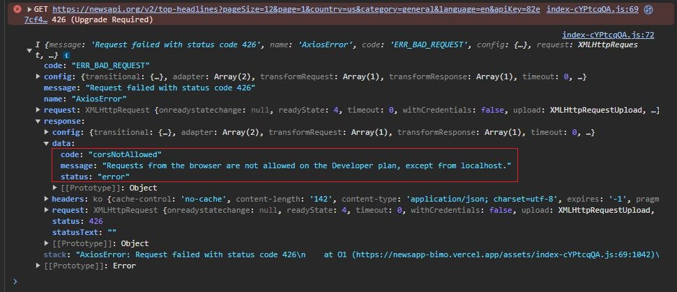
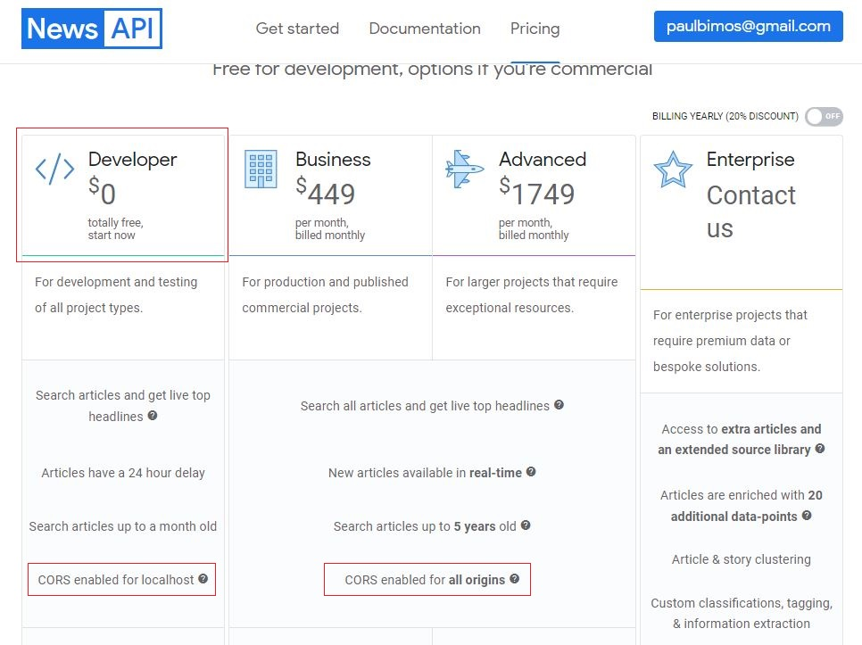

# News App

## Deployment

- Netlify: https://newsapp-bimo.netlify.app/
- Vercel: https://newsapp-bimo.vercel.app/

## Fitur

- Fungsi pencarian dengan beberapa query (Kata, Country, Category, Language).
- Jika berita di klik, otomatis akan ter-redirect ke website terkait.
- Penyimpanan berita yang sudah pernah dibuka dengan localStorage.
- Efek skeleton loading.
- Date Conversion untuk mengubah format penganggalan.

## Tech Stack

- React JS
- Tailwind CSS
- Netlify & Vercel
- Newsapi

## Cara menjalankan di Localhost

- Download source code atau clone dengan command ``git clone https://github.com/Bimzking1/newsapp.git``
- Masuk ke terminal dan install package dengan command ``npm install``
- Jalankan aplikasi melalui terminal dengan command ``npm run dev``
  

## Notes

- Newsapi dengan layanan gratis tidak bisa digunakan melalui Netlify atau Vercel. Harus dijalankan dengan localhost.

- Untuk menjalankan service newsapi dari mana saja, harus mengupgrade subscription ke Business, Advanced, atau Enterprise plan.

## Kontak

- Email: paulbimos@gmail.com
- WA: 0878 4075 8430